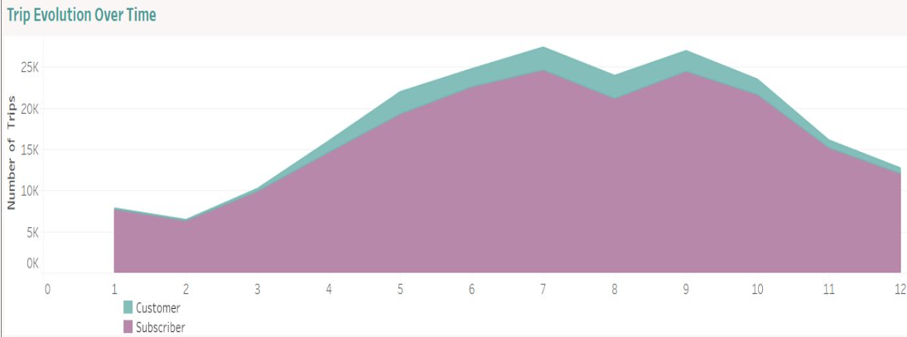
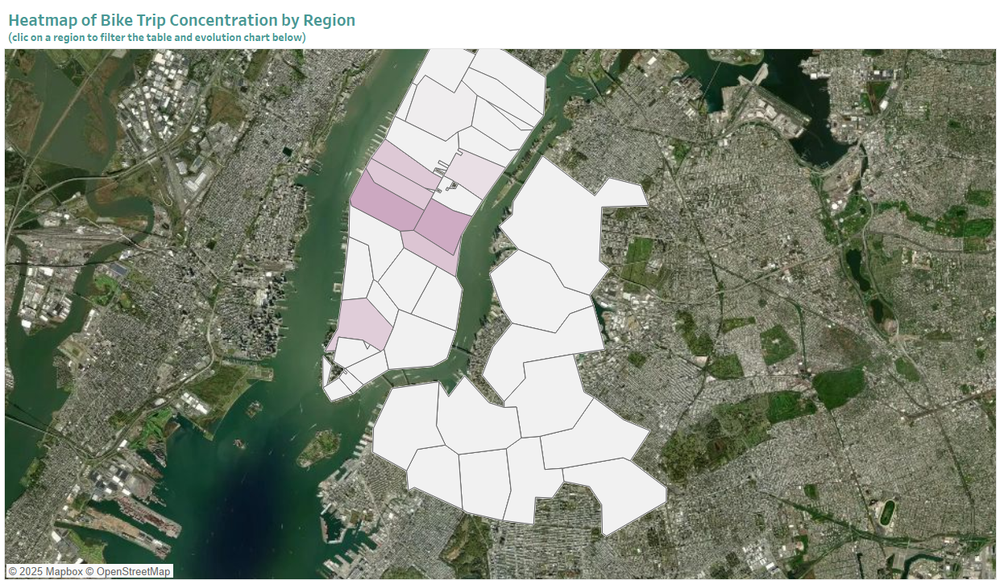
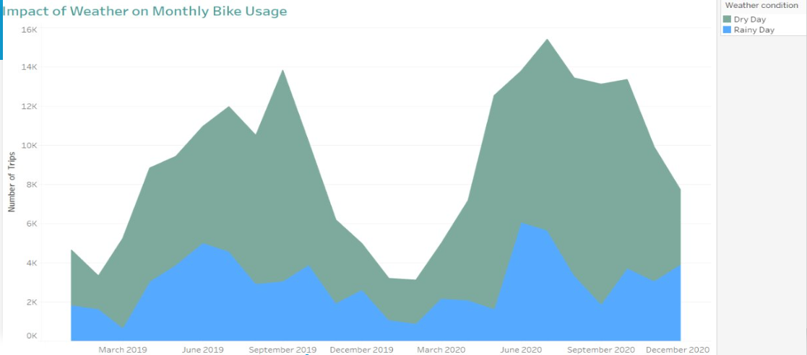
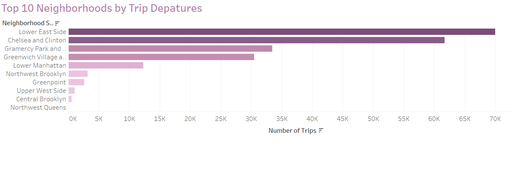
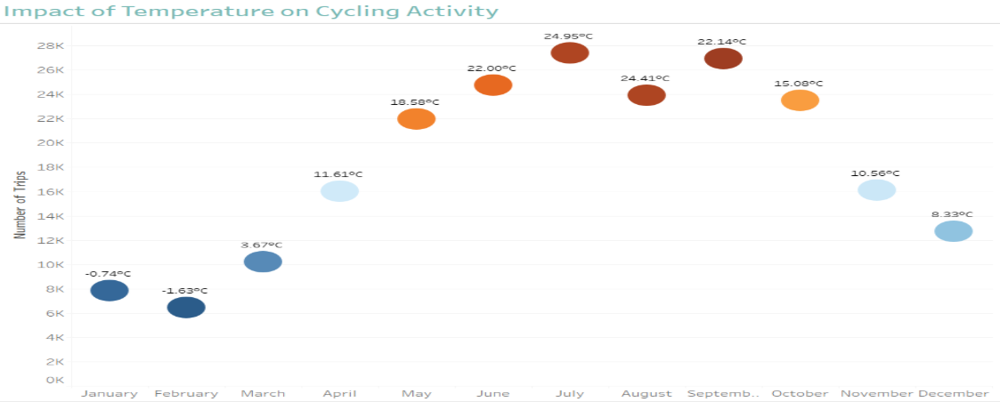

# 🚴 Cyclistic Dashboard Project

## 📌 Overview

This project aims to analyze shared bike trips in New York (CitiBike) to better understand user behavior based on geography, seasons, and weather conditions.

## 🎯 Dashboard Objectives

- Identify high-activity zones to optimize station placement.
- Understand the impact of weather on bike usage.
- Segment user behavior between subscribers and casual users.
- Provide clear insights for stakeholders: marketing, product, and executive teams.

---

## 📂 Repository Structure

---

## 📊 Datasets Used

- **CitiBike Trips** (BigQuery Public Data)
- **NOAA Weather (GSOD)** – for temperature, wind, and precipitation
- **ZIP Code Boundaries** – to enrich geographic context

---

## 📁 Key Visualizations

### 📈 Trip Evolution Over Time
Shows the evolution of customer vs subscriber rides over the months.  

### 🗺️ Heatmap of Bike Trip Concentration
Highlights areas with high bike trip density in NYC.  

### 🌧️ Impact of Weather on Monthly Bike Usage
Displays how dry vs rainy days influence ride frequency.  

### 🏙️ Top 10 Neighborhoods by Trip Departures
Reveals the neighborhoods with the highest number of bike departures.  

### 🌡️ Impact of Temperature on Cycling Activity
Analyzes trip counts in relation to average monthly temperatures.  

---
## 🎤 Project Presentation

📄 [View the stakeholder presentation (PDF)](presentation/The%20NYC%20Bike%20Case.pdf)

This presentation provides a summary of the project insights, methodology, and key visual findings.

---

## 🚴 Featured Project: The NYC Bike Case

📁 This project analyzes shared bike usage in New York City using CitiBike trip data, weather records, and ZIP code zones. It includes:

- A BigQuery SQL query to prepare the dataset
- A Tableau Public dashboard
- Documentation and final stakeholder presentation
- Key visualizations

---

🔗 [Explore the Cyclistic Dashboard Folder](./Cyclistic-Dashboard)

📄 [View the SQL Query](./Cyclistic-Dashboard/sql/analyse_cyclistic.sql)  
📊 [View the Dashboard (Tableau)](https://public.tableau.com/...)  
📁 [Download the Presentation](./Cyclistic-Dashboard/presentation/The%20NYC%20Bike%20Case.pdf)

## 💻 Interactive Dashboard

You can explore the interactive version of this dashboard on Tableau Public:

👉 [Click here to open the dashboard](https://public.tableau.com/app/profile/el.khlife.messoud/vizzes)

The dashboard includes:
- Seasonal analysis
- Weather impact on trip volume
- Geographic heatmaps
- Subscriber vs. Customer segmentation

  ---

## 🔗 Useful Links

- [🌐 Tableau Public Dashboard](https://public.tableau.com/...) *(interactive version)*
- [Notion Portfolio](https://www.notion.so/Hi-I-m-El-Khlife-1c9ae5fde1768064ab3fd318e82c3760)

---

## 👨‍💼 Author

**El Khlife Messoud**  
Business Intelligence Analyst  
April 2025
